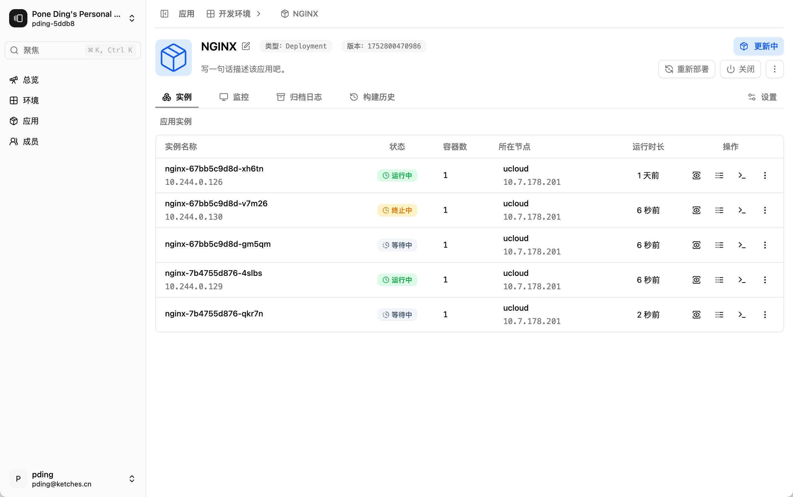
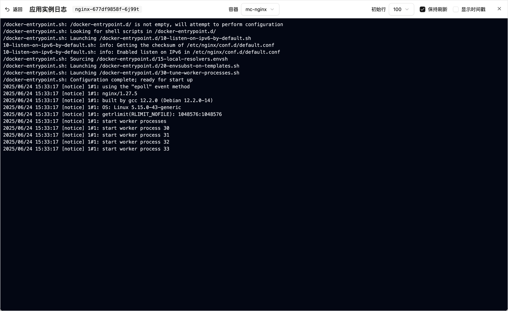
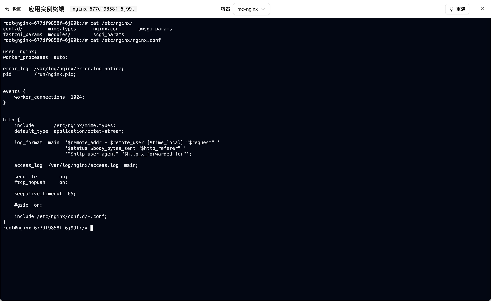

# Ketches

A cloud-native application platform for building and deploying applications.

## Installation

### Backend

1. Configure configs in [config.yaml](./backend/config/config.yaml)

2. Run the backend server

```bash
cd backend
make run
```

This will migrate the database automatically and start the server on port 8080.

### Frontend

1. Make sure environment variables set in `[.env](./frontend/.env)` file are correct.
2. Run the frontend server

```bash
cd frontend
yarn
yarn dev
```

This will start the frontend server on port 5173.

Here you go! You can now access the Ketches application at `http://localhost:5173`.

## Features

Admin panel

---

- [x] User management
  - [x] User sign-up
  - [x] User sign-in
  - [x] User sign-out
  - [ ] User profile management
- [ ] Cluster management(WIP)
  - [x] Add cluster in KubeConfig format
- [ ] Cluster extension management(WIP: Observability, Gateway-API, AI-Analytics)
- [x] Multi-cluster management

User panel

---

- [ ] Project management(WIP)
  - [x] Project membership management
- [ ] Environment management(WIP)
- [ ] Application management(WIP)
  - [x] Deploy application in container image format
  - [ ] Deploy application in kubernetes manifest format
  - [ ] Deploy application in source code format
  - [ ] Deploy application from AppHub
  - [ ] Application environment variables management
  - [ ] Application volume management
  - [ ] Application mutli-container management(Plugins)
  - [ ] Application gateway management
  - [ ] Application health check management
  - [ ] Application scaling management
  - [ ] Application schedule management
  - [x] Application instance container logs
  - [x] Application instance container terminal
  - [ ] Application observability(Need cluster extension installed)
  - [ ] Application logs archive(Need cluster extension installed)
- [ ] Volume management(WIP)
- [ ] AppHub management(WIP)

- [ ] ...

## Screenshots




