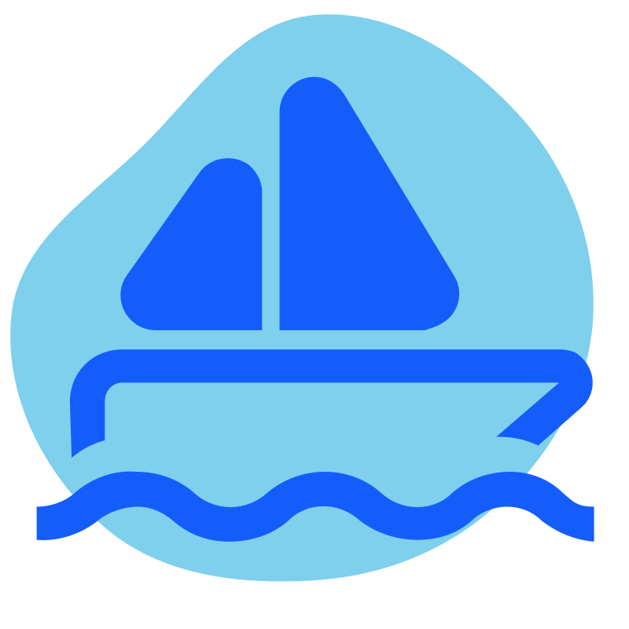

<div align="center">



# Ketches

**A cloud-native application platform that makes Kubernetes simple.**

[](https://github.com/ketches/ketches/actions/workflows/ci.yml)
[](https://github.com/ketches/ketches/actions/workflows/release.yml)
[](go.mod)
[](LICENSE)
[](https://github.com/ketches/ketches/releases)

[English](README.md) · [简体中文](README_zh-CN.md)

</div>

---

## Overview

Ketches is an enterprise-grade, open-source cloud-native application platform designed to lower the barrier of Kubernetes adoption. It provides an intuitive web UI and a comprehensive REST API to help development teams build, deploy, and manage applications across multiple Kubernetes clusters — without needing deep Kubernetes expertise.

## ✨ Features

| Category | Highlights |
| -------- | --------- |
| **Multi-Cluster** | Connect and manage unlimited Kubernetes clusters via KubeConfig |
| **Project & Environment** | Hierarchical project → environment → application model with namespace isolation |
| **Application Lifecycle** | Deploy, start, stop, redeploy, rollback, and debug containerized applications |
| **Real-time Operations** | Live log streaming and in-browser WebSocket terminal per pod |
| **Gateway Management** | HTTP / HTTPS / TCP / UDP ingress rules via Gateway API |
| **Resource Management** | CPU/memory limits, persistent volumes, ConfigMap-backed config files |
| **Health Checks** | Liveness, readiness and startup probes with flexible probe modes |
| **Scheduling** | Node selector, node affinity, and toleration rules |
| **RBAC** | System-level (admin / user) and project-level (owner / developer / viewer) roles |
| **Runtime Database** | PostgreSQL by default, MySQL optional, pure-Go SQLite in tests |
| **Cluster Extensions** | Install and manage Helm-based extensions (Gateway API, monitoring, etc.) |

## 🏗️ Architecture

```txt
┌──────────────────────────────────────────────────────────────────┐
│                          User Browser                            │
└──────────────────────────────────────────────────────────────────┘
                                │ HTTPS
                                ▼
┌──────────────────────────────────────────────────────────────────┐
│                      Nginx / Ingress                             │
│                 (Reverse proxy & static assets)                  │
└───────────────────────┬──────────────────────┬───────────────────┘
                        │ /                    │ /api/*
                        ▼                      ▼
        ┌───────────────────────┐   ┌──────────────────────────┐
        │   ketches-ui (React)  │   │   ketches API (Go/Gin)   │
        │   shadcn/ui · Zustand │   │   Routes → Handlers      │
        │   TanStack Query      │   │   → Services → Core      │
        └───────────────────────┘   └────────────┬─────────────┘
                                                 │
                        ┌────────────────────────┼──────────────────────┐
                        ▼                        ▼                      ▼
             ┌──────────────────┐    ┌────────────────────┐  ┌────────────────────┐
             │   Database       │    │  Kubernetes        │  │  Kubernetes        │
             │ PostgreSQL /     │    │  Cluster 1         │  │  Cluster N         │
             │ MySQL            │    │  (client-go)       │  │  (client-go)       │
             └──────────────────┘    └────────────────────┘  └────────────────────┘
```

**Backend layers**: Routes → Middlewares (Auth/CORS/RBAC) → Handlers → Services → Core (K8s resource builder) → Kube client (client-go) → DB (GORM)

## 🚀 Quick Start

### Docker Compose (recommended)

**Prerequisites**: Docker 24+ with Compose V2

```bash
curl -fsSL https://raw.githubusercontent.com/ketches/ketches/master/deploy/docker/docker-compose.yml -o docker-compose.yml
curl -fsSL https://raw.githubusercontent.com/ketches/ketches/master/deploy/docker/.env.quickstart -o .env
docker compose up -d
```

This quickstart path is for local evaluation only. It uses checked-in demo secrets from `deploy/docker/.env.quickstart` so you can get running immediately. For real environments, keep `deploy/docker/docker-compose.yml` as-is and follow the production guide: [Production Deployment Guide](docs/PRODUCTION_DEPLOYMENT.md).

Quickstart creates a bootstrap admin account automatically and disables sign-up email verification by default:

```txt
username: kadmin
password: KetchesBootstrapAdmin!ChangeMe
```

Override behavior when needed:

```txt
BOOTSTRAP_ADMIN_USERNAME=<custom-admin-username>
BOOTSTRAP_ADMIN_PASSWORD=<custom-admin-password>
SIGN_UP_EMAIL_VERIFICATION_REQUIRED=false
```

If you enable sign-up email verification, configure SMTP delivery as well:

```txt
SMTP_HOST=smtp.example.com
SMTP_PORT=587
SMTP_USERNAME=mailer@example.com
SMTP_PASSWORD=<smtp-password>
SMTP_FROM=mailer@example.com
```

### Helm (Kubernetes)

**Prerequisites**: Kubernetes 1.24+, Helm 3.12+

```bash
helm upgrade --install ketches ./deploy/helm/ketches --namespace ketches --create-namespace -f ./deploy/helm/ketches/values-quickstart.yaml
```

This quickstart path is intended for local evaluation clusters only. The main Helm chart remains secure-by-default and expects you to provide real secrets for non-quickstart usage.

### Raw Kubernetes manifests

**Prerequisites**: Kubernetes 1.24+

```bash
kubectl apply -f https://raw.githubusercontent.com/ketches/ketches/master/deploy/kubernetes/manifests.quickstart.yaml
```

This quickstart manifest is for local evaluation only. It bakes in demo secrets and localhost-friendly CORS values so raw-manifest installs behave like the other quickstart paths.

More details: [`deploy/kubernetes/README.md`](deploy/kubernetes/README.md)

The quickstart UI service type is `NodePort` (`30080`):

```bash
kubectl -n ketches get svc ketches-ui
```

Or access via port-forward:

```bash
kubectl -n ketches port-forward svc/ketches-ui 3000:3000
# open http://127.0.0.1:3000
```

For production, do not reuse the quickstart values file. Provide strong values for `config.jwtSecret` and `config.secretEncryptionKey`, set `postgres.auth.password` when using the bundled PostgreSQL instance, and review [Production Deployment Guide](docs/PRODUCTION_DEPLOYMENT.md). If you use an external database, set `postgres.enabled=false` and provide `config.dbSource` (or the split `config.db*` values).

#### Helm Chart Repository (GitHub Pages)

This repository includes automated chart publishing in `.github/workflows/release.yml`.

On every tag push matching `v*`, GitHub Actions will package `deploy/helm/ketches`, update `index.yaml`, and publish artifacts to the `gh-pages` branch.

One-time setup:

1. In GitHub repository settings, open **Pages**.
2. Set **Source** to **Deploy from a branch**.
3. Select branch **gh-pages** and folder **/**.
4. Save.

Then users can install from GitHub Pages:

```bash
helm repo add ketches https://ketches.github.io/ketches
helm repo update
helm search repo ketches
helm install ketches ketches/ketches -n ketches --create-namespace
```

### Build from Source

**Prerequisites**: Go 1.25+, Node.js 22+

```bash
git clone https://github.com/ketches/ketches.git
cd ketches

# Copy and edit environment config
cp .env.example .env

# Build backend
make build

# Build frontend
make build-ui

# Run backend (serves API on :8080)
make run
# In another terminal — run frontend dev server
make dev-ui
```

## ⚙️ Configuration

All configuration is done via environment variables. A `.env` file is optional for local development.

| Variable | Default | Description |
| -------- | ------- | ----------- |
| `PORT` | `8080` | API server listen port |
| `LOG_LEVEL` | `info` | Log level (`debug` / `info` / `warn` / `error`) |
| `DB_DRIVER` | `postgres` | Runtime database driver (`postgres` / `mysql`) |
| `DB_SOURCE` | *(optional)* | Full database connection string; takes precedence over split database variables |
| `DB_HOST` | driver-specific | Database host when `DB_SOURCE` is not set |
| `DB_PORT` | driver-specific | Database port when `DB_SOURCE` is not set |
| `DB_NAME` | `ketches` | Database name when `DB_SOURCE` is not set |
| `DB_USERNAME` | driver-specific | Database username when `DB_SOURCE` is not set |
| `DB_PASSWORD` | empty | Database password when `DB_SOURCE` is not set |
| `DB_SSLMODE` | `disable` | PostgreSQL SSL mode when `DB_SOURCE` is not set |
| `DB_AUTO_MIGRATE` | `true` | Whether to run GORM AutoMigrate during database initialization |
| `JWT_SECRET` | *(required)* | Secret key for signing JWT tokens |
| `SECRET_ENCRYPTION_KEY` | *(required)* | Encryption key for sensitive values stored at rest |
| `BOOTSTRAP_ADMIN_USERNAME` | `kadmin` | Optional override for the bootstrap admin username |
| `BOOTSTRAP_ADMIN_PASSWORD` | `KetchesBootstrapAdmin!ChangeMe` | Optional override for the bootstrap admin password |
| `SIGN_UP_EMAIL_VERIFICATION_REQUIRED` | `true` | Whether public sign-up requires an email verification code |
| `SMTP_HOST` | empty | SMTP server host, required when email verification is enabled |
| `SMTP_PORT` | `587` | SMTP server port |
| `SMTP_USERNAME` | empty | SMTP username |
| `SMTP_PASSWORD` | empty | SMTP password |
| `SMTP_FROM` | empty | Sender address used for verification emails |
| `CORS_ALLOWED_ORIGINS` | `http://localhost:3000,...` | Comma-separated allowed CORS origins |

**Note**: For production environments, set `DB_AUTO_MIGRATE=false` and manage schema migrations through a controlled migration process.

SQLite is no longer a supported runtime database. It remains test-only through a pure-Go driver so backend builds do not require CGO.

**PostgreSQL example**:

```bash
DB_DRIVER=postgres
DB_HOST=localhost
DB_PORT=5432
DB_NAME=ketches
DB_USERNAME=postgres
DB_PASSWORD=<db-password>
DB_SSLMODE=disable
```

**MySQL example**:

```bash
DB_DRIVER=mysql
DB_HOST=localhost
DB_PORT=3306
DB_NAME=ketches
DB_USERNAME=root
DB_PASSWORD=<db-password>
```

If you prefer, you can still provide a complete `DB_SOURCE` directly.

See [`.env.example`](.env.example) for the full reference.

## 🛠️ Development

### Prerequisites

| Tool | Version | Notes |
| ---- | ------- | ----- |
| Go | 1.25+ | Backend |
| Node.js | 22+ | Frontend |
| Docker | 24+ | Optional — for containerized development |

### Common `make` targets

```bash
make help          # List all available targets

# Build
make build         # Compile Go binary → bin/ketches
make build-ui      # Compile frontend → ui/dist/
make build-all     # Both

# Development
make run           # Start API server (reads .env)
make dev-ui        # Start Vite dev server at :5173
make openapi       # Generate openapi/openapi.json and openapi/openapi.yaml

# Testing
make test          # Run tests with race detector
make test-coverage # Open HTML coverage report

# Linting
make lint          # golangci-lint (backend)
make lint-ui       # eslint (frontend)

# Docker
make docker-build  # Build API + UI images locally
make docker-buildx # Build & push multi-arch images (amd64 + arm64)
make up            # docker compose up -d --build
make down          # docker compose down
make logs          # docker compose logs -f
```

### Project Structure

```txt
ketches/
├── cmd/api/            # Application entry point
├── internal/
│   ├── api/            # Common request/response helpers
│   ├── app/            # App-level config, JWT, constants
│   ├── core/           # Kubernetes resource builder (Deployment, Service, etc.)
│   ├── db/             # GORM entities and migrations
│   ├── handlers/       # HTTP handlers (one file per domain)
│   ├── kube/           # Kubernetes client store
│   ├── middlewares/    # Auth, CORS middlewares
│   ├── models/         # Request/response models
│   ├── routes/         # API route definitions
│   └── services/       # Business logic layer
├── ui/                 # React + TypeScript frontend
│   ├── src/
│   │   ├── api/        # Axios API client modules
│   │   ├── components/ # Feature components
│   │   ├── pages/      # Page-level components
│   │   ├── stores/     # Zustand stores
│   │   └── hooks/      # Custom React hooks
│   ├── Dockerfile
│   └── nginx.conf.template
├── docs/               # PRD and Technical Design
├── Dockerfile          # Backend image
├── docker-compose.yml
└── Makefile
```

## 🤝 Contributing

Contributions are welcome! Please follow these steps:

1. **Fork** the repository and create a branch from `main`
2. **Commit** your changes with clear, descriptive messages
3. **Test** your changes — `make test` for backend, `make lint-ui` for frontend
4. Open a **Pull Request** — CI must pass before merge

### Code Style

- **Backend**: Follow standard Go conventions; use `any` instead of `interface{}`; English comments only
- **Frontend**: Use shadcn/ui components; Tailwind CSS for all styling; no inline CSS; English comments only

## 📦 Docker Images

Pre-built multi-arch images (`linux/amd64` + `linux/arm64`) are published to the GitHub Container Registry on every release:

```bash
# API
docker pull ghcr.io/ketches/ketches-api:latest

# UI
docker pull ghcr.io/ketches/ketches-ui:latest
```

Browse all tags: [ghcr.io/ketches](https://github.com/orgs/ketches/packages)

## 📄 License

Ketches is released under the [Apache 2.0 License](LICENSE).
