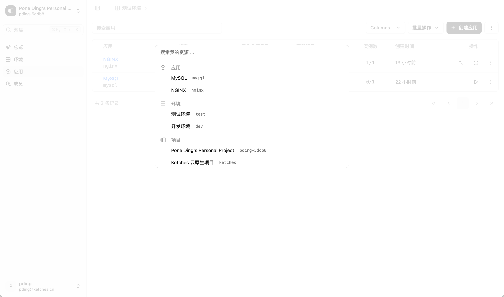

# Ketches

[English](./README.md) | 简体中文

一个云原生应用平台，用于构建、部署和管理应用。

## 安装

### Kubernetes

1. 确保你有可用的 Kubernetes 集群，并已配置好 `kubectl`。
2. 应用 Ketches 的 Kubernetes 部署清单：

```bash
kubectl apply -f https://raw.githubusercontent.com/ketches/ketches/master/deploy/kubernetes/manifests.yaml
```

> 说明：Kubernetes 部署，存储默认使用 PostgreSQL，前端服务使用 Nginx 反向代理。

### Docker Compose

1. 确保已安装 Docker 和 Docker Compose。
2. 下载 Docker Compose 文件：

```bash
mkdir ketches && cd ketches
curl -O https://raw.githubusercontent.com/ketches/ketches/master/deploy/docker-compose/docker-compose.yaml

docker compose up -d
```

> 说明：Docker Compose 部署，存储默认使用 PostgreSQL。

### 源码运行

1. 克隆仓库：

```bash
git clone https://github.com/ketches/ketches.git
cd ketches
```

2. 运行后端服务（默认使用 SQLite，可在 `.env` 文件中修改）：

```bash
cd backend
make run
```

这会自动迁移数据库并在 8080 端口启动服务。

### 前端

1. 确认 `[.env](./frontend/.env)` 文件中的环境变量配置正确。
2. 运行前端服务：

```bash
cd frontend
yarn
yarn dev
```

前端服务默认运行在 5173 端口。

现在你可以通过 `http://localhost:5173` 访问 Ketches 应用。

## 后端配置

后端配置详见 [Ketches 后端 API 环境变量配置说明](./docs/zh_CN/backend-env.md)。

## 功能特性

- 管理后台
  - [x] 用户管理（注册、登录、登出）
  - [ ] 用户资料管理
  - [x] 集群管理（KubeConfig 导入）
  - [ ] 集群扩展管理（可观测性、网关、AI 分析等）
  - [x] 多集群管理
- 用户面板
  - [ ] 项目管理
  - [ ] 环境管理
  - [ ] 应用管理（支持容器镜像、K8s清单、源码、AppHub等多种方式部署）
  - [x] 应用环境变量管理
  - [x] 应用卷管理
  - [ ] 应用多容器管理（插件）
  - [x] 应用网关管理
  - [x] 应用健康检查管理
  - [x] 应用伸缩管理
  - [x] 应用调度管理
  - [x] 实例日志
  - [x] 实例终端
  - [ ] 可观测性（需要集群扩展）
  - [ ] 日志归档（需要集群扩展）
- [ ] 卷管理
- [ ] AppHub 管理

## 截图




